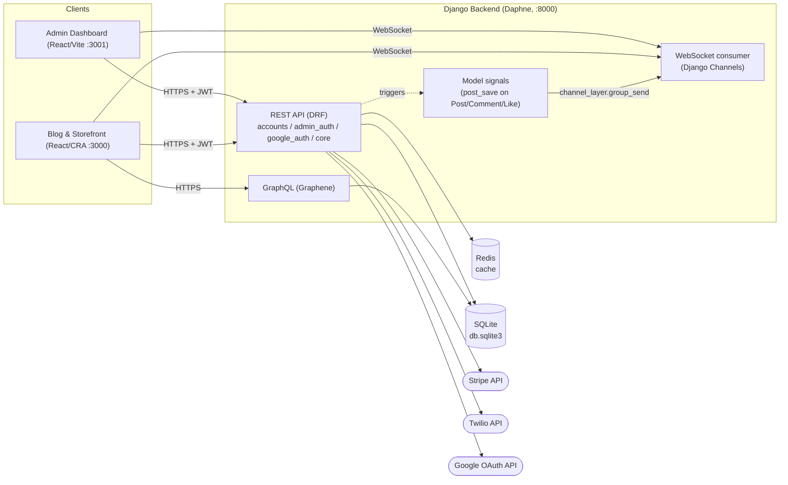

# Backend API

A Django REST/GraphQL backend for a blogging + small e-commerce platform: JWT and Google-OAuth
authentication, posts/comments/likes, a subscriptions & Stripe checkout flow, phone/email
verification via Twilio, and real-time notifications over WebSockets.

## Tech stack

- **Django 4.1** + **Django REST Framework** - REST API
- **Graphene-Django** - GraphQL endpoint (`/graphql`)
- **Django Channels** + **Daphne** - WebSockets (ASGI) for live notifications
- **SimpleJWT** + **OAuth2 (django-oauth-toolkit)** + Google OAuth - authentication
- **Redis** (`django-redis`) - cache backend
- **Stripe** - subscription checkout
- **Twilio** - SMS verification codes
- **SQLite** - default database (swap `DATABASES` in `task1/settings.py` for Postgres/MySQL in production)

## Apps

| App | Responsibility |
|---|---|
| `core` | Domain models (users, posts, comments, likes, categories/tags, subscriptions, e-commerce items, notifications), the main REST API, GraphQL schema, and WebSocket consumers |
| `accounts` | Public register/login/logout and JWT token endpoints |
| `admin_auth` | Login endpoint for admins/creators/editors (used by the admin dashboard frontend) |
| `google_auth` | Google OAuth login/signup |

## System design

### Architecture

Two ASGI-served entry points share one Django app: synchronous REST/GraphQL requests, and a
WebSocket channel for push notifications. Both talk to the same SQLite database; Redis backs the
cache layer (channel routing itself is in-memory, see [Real-time caveat](#real-time-notifications)).



### Authentication - three separate surfaces, one user table

There's a single `CustomUser` model (email as the username field, in `core`), but three
independent login endpoints, each returning its own JWT pair (`rest_framework_simplejwt`):

- **`accounts`** (`/auth/login/`) - public sign-up/login for end users on the blog/storefront.
- **`admin_auth`** (`/ad/login/`) - same credentials, but rejects the login unless the user is a
  superuser, `is_creator`, or `is_editor`. Used by the admin dashboard.
- **`google_auth`** (`/social_auth/test/`) - verifies a Google ID token server-side against
  Google's `tokeninfo` endpoint, then finds-or-creates a `CustomUser` and issues the same JWT pair.

Access tokens are short-lived (15 min); refresh tokens (1 day) rotate and are blacklisted on use
(`rest_framework_simplejwt.token_blacklist`). `django-oauth-toolkit` is also installed for
third-party OAuth2 client access to the API, separate from the JWT flow above.

### Real-time notifications

Likes, comments and new posts push a live notification without polling:

1. A REST view saves a `Post`/`Comment`/`Like`.
2. A `post_save` signal (`core/signals.py`) fires, builds a notification payload, and calls
   `channel_layer.group_send(...)`.
3. Each connected client's `ChatConsumer` (`core/consumers.py`) joined that group on connect
   (`ws/test/<room_name>/`, one group per user ID, plus an `admin_group` for staff) and pushes the
   payload down its WebSocket.

The channel layer is `InMemoryChannelLayer` - fine for a single dev/demo process, but it means
group membership isn't shared across multiple backend processes/replicas. Swapping in
`channels_redis` (Redis-backed) is the natural next step for running more than one backend
instance.

### Caching

`django-redis` backs Django's cache framework (`CACHES["default"]`), pointed at the `redis`
service in Docker Compose. It isn't yet used for view/query caching (only wired up as
infrastructure) - the `cache` import is available across `core` views for anyone adding it.

### External integrations

- **Stripe** - subscription checkout sessions (`core/views.py`), redirecting back to
  `FRONTEND_URL` on success/cancel.
- **Twilio** - SMS one-time codes for phone verification.
- **Email** (SMTP, defaults to a Mailtrap sandbox) - email verification codes.
- **Google reCAPTCHA** - bot protection on registration.

### Data model

See [`docs/schema.dbml`](docs/schema.dbml) and [`docs/schema-diagram.png`](docs/schema-diagram.png)
for the full entity-relationship diagram of the `core` models (users, posts, comments, likes,
categories/tags, subscriptions, e-commerce items, notifications).

## Running with Docker (recommended)

From the repo root (this backend is one of three services in the root `docker-compose.yml`,
alongside the admin dashboard and blog frontends):

```bash
docker compose up -d redis backend
```

This builds the image, runs migrations, and starts the dev server at `http://localhost:8000`.

## Running locally without Docker

```bash
python -m venv venv
source venv/bin/activate  # venv\Scripts\activate on Windows
pip install -r requirements.txt
cp .env.example .env      # fill in any keys you need (all have safe dev defaults)
python manage.py migrate
python manage.py runserver 0.0.0.0:8000
```

Redis is required for the cache backend - either run `docker run -p 6379:6379 redis` or
point `REDIS_URL` in `.env` at an existing instance.

## Configuration

All secrets and environment-specific values are read from environment variables (via
`python-decouple`) - see [`.env.example`](.env.example) for the full list. Nothing sensitive
is hardcoded in `settings.py`; every value has a working default for local development.

## Seeding demo data

```bash
python manage.py createsuperuser --email admin@gmail.com  # seed_data attaches posts/items to this user
python manage.py seed_data 10
```

Creates categories/tags, posts, comments, likes, subscriptions and e-commerce items so the
API/GraphQL/admin panel have something to show.

## Key endpoints

- `/admin/` - Django admin
- `/graphql` - GraphiQL / GraphQL API
- `/auth/register/`, `/auth/login/`, `/auth/logout/` - account endpoints
- `/ad/login/` - admin/creator/editor login
- `/social_auth/test/` - Google OAuth login
- `/` - blog, comments, likes, e-commerce, payments, notifications (see `core/urls.py`)
- `ws/test/<room_name>/` - WebSocket notifications

## Database schema

See [`docs/schema.dbml`](docs/schema.dbml) and [`docs/schema-diagram.png`](docs/schema-diagram.png)
for an entity-relationship overview of the `core` models.

## Tests

```bash
pytest --cov
```
